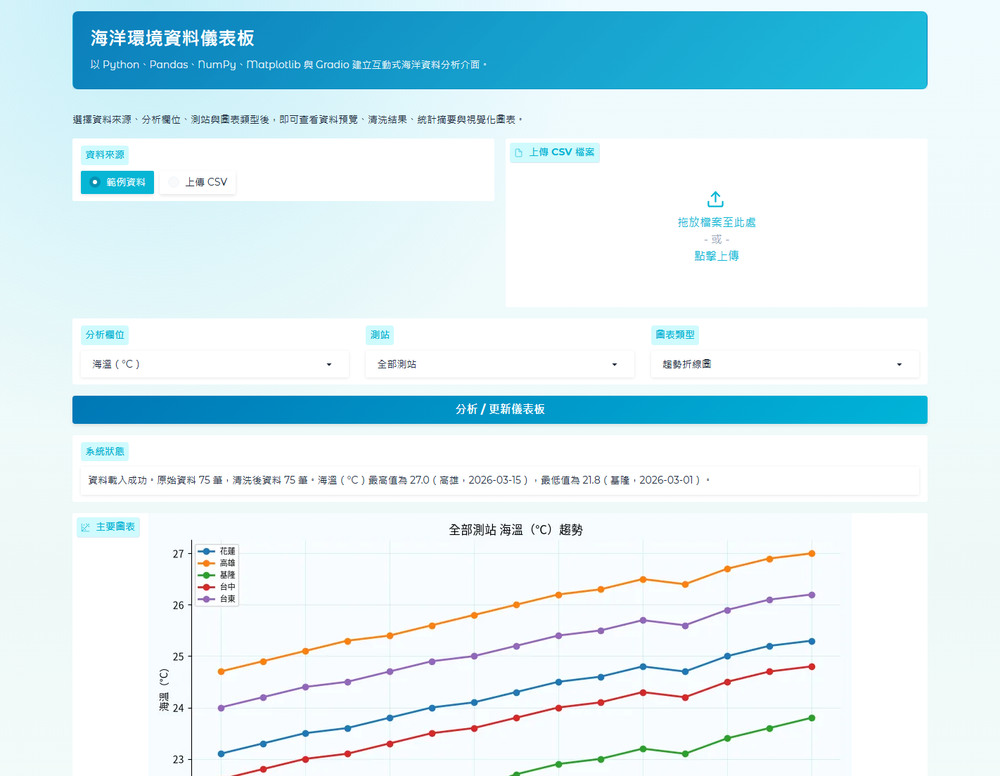

# 海洋環境資料儀表板

## 專題資訊

| 項目 | 說明 |
| --- | --- |
| 課程 | 114-2 巨量資料與雲端運算 |
| 專題名稱 | 海洋環境資料儀表板 |
| 專題形式 | 小組專題 |
| 應用類型 | 資料分析儀表板 |
| 主要資料 | `data/raw/sample_ocean_data.csv` |
| 啟動方式 | 本機 Python 或 Docker |
| Web 介面 | Gradio |
| 預設網址 | `http://localhost:7860` |

## 組員資訊

| 序號 | 姓名 | 學號 |
| --- | --- | --- |
| 組員 1 |  |  |
| 組員 2 |  |  |
| 組員 3 |  |  |
| 組員 4 |  |  |
| 組員 5 |  |  |

本專案是「114-2 巨量資料與雲端運算」期末專題，主題為「海洋環境資料儀表板」。  
專案目標是使用 Python 完成海洋環境資料的讀取、清洗、統計分析與視覺化，並透過 Gradio 建立可操作的互動式網頁介面，最後使用 Docker 容器化部署，讓系統可以在本機或容器環境中重現。

系統支援內建範例資料，也支援使用者上傳自己的 CSV 檔案。使用者可以在網頁中查看原始資料、清洗後資料、統計摘要、測站分組統計，以及依照欄位與測站產生的 Matplotlib 圖表。

## 系統截圖

以下為目前 Gradio 儀表板執行畫面，包含資料來源選擇、分析欄位、測站篩選、圖表類型、資料表與視覺化圖表。



## 專題在做什麼

海洋觀測資料通常會以 CSV 或表格形式儲存，例如海溫、潮位、浪高、風速與鹽度等欄位。雖然表格資料適合儲存與交換，但若直接閱讀原始資料，不容易快速看出不同測站、不同日期之間的變化趨勢。

因此本專題建立一個簡單但完整的資料應用流程：

```text
CSV 資料
→ Python 讀取資料
→ Pandas 清洗資料
→ NumPy / Pandas 統計分析
→ Matplotlib 產生圖表
→ Gradio 建立互動式介面
→ Docker 容器化部署
→ 使用瀏覽器開啟系統
```

這個專題的重點不只是畫圖，而是把資料分析流程整理成一個可以互動操作、可以部署、可以重現的系統。

## 專題動機

海洋環境資料包含許多連續觀測數值，對於海事活動、港口管理、漁業活動與海洋環境觀察都有參考價值。不過，原始資料可能會遇到日期格式不一致、數值欄位型態錯誤、缺失值或重複資料等問題。

本專題希望透過 Python 資料分析工具，將原始 CSV 轉換成可清楚閱讀的統計表格與圖表，再用 Gradio 做成互動式儀表板，讓使用者不需要直接修改程式碼，也可以選擇資料來源、分析欄位、測站與圖表類型。

## 使用技術

| 技術 | 用途 |
| --- | --- |
| Python | 主要程式語言 |
| Pandas | CSV 讀取、資料清洗、分組統計 |
| NumPy | 基本統計與數值處理 |
| Matplotlib | 折線圖、長條圖與月份平均圖 |
| Gradio | 建立互動式網頁儀表板 |
| Docker | 容器化部署與環境重現 |
| Jupyter Notebook | 資料探索與初步分析 |

## 課程要求對照

| 課程要求 | 本專案完成內容 |
| --- | --- |
| Python 資料分析 | 使用 Pandas 與 NumPy 完成資料讀取、清洗、統計摘要與分組分析 |
| 資料視覺化 | 使用 Matplotlib 產生趨勢折線圖、測站平均長條圖與月份平均折線圖 |
| 互動式應用 | 使用 Gradio 建立可操作的 Web 儀表板 |
| Docker 容器化 | 提供 `docker/Dockerfile`，可 build 映像檔並以 `7860` port 啟動 |
| 文件完整度 | 提供 README、proposal、data README 與 report |
| 可重現性 | 提供 `requirements.txt`、範例資料與 Docker 執行指令 |

## 系統功能

- 使用內建 `sample_ocean_data.csv` 範例資料。
- 上傳使用者自己的 CSV 檔案。
- 檢查 CSV 是否包含必要欄位。
- 顯示原始資料前 10 列。
- 顯示清洗後資料前 10 列。
- 將 `date` 欄位轉換為 datetime。
- 將海溫、潮位、浪高、風速、鹽度轉為數值欄位。
- 使用平均值補齊數值欄位缺失值。
- 將缺少測站名稱的資料填入 `Unknown`。
- 移除無法轉換日期的資料與重複資料。
- 輸出清洗後資料到 `data/processed/cleaned_ocean_data.csv`。
- 顯示整體統計摘要。
- 顯示依測站分組統計。
- 支援依測站篩選資料。
- 支援產生趨勢折線圖、測站平均長條圖、月份平均折線圖。
- 使用 Docker 啟動後可透過 `http://localhost:7860` 開啟。

## 專案架構

```text
114-2_BigDataCC_OceanDashboard/
│
├── README.md
│
├── my-topics/
│   └── topic_ocean_dashboard.md
│
├── proposal/
│   └── proposal.md
│
├── data/
│   ├── raw/
│   │   └── sample_ocean_data.csv
│   ├── processed/
│   │   └── cleaned_ocean_data.csv
│   └── README.md
│
├── notebooks/
│   └── exploration.ipynb
│
├── src/
│   ├── __init__.py
│   │
│   ├── analysis/
│   │   ├── __init__.py
│   │   ├── clean_data.py
│   │   └── analyze_data.py
│   │
│   ├── app/
│   │   ├── __init__.py
│   │   └── gradio_app.py
│   │
│   └── utils/
│       ├── __init__.py
│       └── data_loader.py
│
├── docker/
│   └── Dockerfile
│
├── docs/
│   ├── report.md
│   ├── screenshots/
│   │   └── ocean_dashboard_home.png
│
├── tests/
│   └── test_ocean_dashboard.py
│
├── .gitignore
└── requirements.txt
```

## 主要程式說明

| 檔案 | 說明 |
| --- | --- |
| `my-topics/topic_ocean_dashboard.md` | 個人選題探索與題目可行性說明 |
| `proposal/proposal.md` | 專題提案，包含動機、資料、技術、架構與預期成果 |
| `src/utils/data_loader.py` | 讀取範例 CSV 或使用者上傳的 CSV，並處理本機與 Docker 路徑 |
| `src/analysis/clean_data.py` | 執行資料清洗、欄位轉換、缺失值補齊、重複資料移除與清洗結果輸出 |
| `src/analysis/analyze_data.py` | 產生整體統計、測站統計、月份平均與最大最小值分析 |
| `src/app/gradio_app.py` | 建立 Gradio Web UI，整合資料讀取、清洗、分析與圖表顯示 |
| `docker/Dockerfile` | 建立 Docker 映像檔，安裝 Python 套件與中文字型 |
| `notebooks/exploration.ipynb` | 用 Jupyter Notebook 進行初步資料探索 |
| `docs/report.md` | 期末報告初稿 |

## 資料來源與欄位說明

本專案的範例資料位於：

```text
data/raw/sample_ocean_data.csv
```

資料為期末專題展示用之模擬資料，格式參考海洋觀測資料常見欄位設計，主要用於展示資料清洗、統計分析與視覺化流程。

資料概況：

| 項目 | 內容 |
| --- | --- |
| 資料筆數 | 75 筆 |
| 日期範圍 | 2026-03-01 至 2026-03-15 |
| 測站數量 | 5 個 |
| 測站名稱 | Keelung、Taichung、Kaohsiung、Hualien、Taitung |
| 缺失值 | 範例資料目前無缺失值，系統仍保留缺失值處理機制 |

| 欄位名稱 | 說明 | 單位或格式 |
| --- | --- | --- |
| `date` | 觀測日期 | `YYYY-MM-DD` |
| `station` | 測站名稱 | Keelung、Taichung、Kaohsiung、Hualien、Taitung |
| `sea_temperature_c` | 海溫 | 攝氏度 |
| `tide_level_m` | 潮位 | 公尺 |
| `wave_height_m` | 浪高 | 公尺 |
| `wind_speed_mps` | 風速 | m/s |
| `salinity_psu` | 鹽度 | PSU |

## 資料清洗流程

系統在分析前會先執行以下清洗步驟：

1. 檢查資料是否包含必要欄位。
2. 將 `date` 欄位轉成 datetime 格式。
3. 將數值欄位轉成 numeric 格式。
4. 移除無法轉換日期的資料列。
5. 數值欄位缺失值使用該欄位平均值補齊。
6. `station` 欄位缺失值填入 `Unknown`。
7. 移除重複資料。
8. 依照 `date` 與 `station` 排序。
9. 儲存清洗後資料到 `data/processed/cleaned_ocean_data.csv`。

## 統計分析與圖表

系統目前支援以下分析欄位：

- `sea_temperature_c`
- `tide_level_m`
- `wave_height_m`
- `wind_speed_mps`
- `salinity_psu`

支援的分析結果包含：

- 整體統計摘要：平均值、標準差、最小值、最大值與四分位數。
- 測站分組統計：依照測站比較不同欄位的平均值與分布。
- 月份平均分析：觀察欄位在不同月份的平均變化。
- 極值分析：找出指定欄位的最大值與最小值。

支援的圖表類型包含：

- `Trend Line Chart`：依日期顯示欄位變化趨勢。
- `Station Average Bar Chart`：比較不同測站的平均值。
- `Monthly Average Line Chart`：顯示月份平均變化。

圖表座標軸與標題主要使用英文，目的是降低 Docker 或不同作業系統中文字型顯示問題。

## 本機執行方式

以下指令請在專案根目錄執行：

```bash
cd 114-2_BigDataCC_OceanDashboard
```

安裝套件：

```bash
pip install -r requirements.txt
```

啟動 Gradio App：

```bash
python -m src.app.gradio_app
```

啟動後在瀏覽器開啟：

```text
http://localhost:7860
```

## Docker 部署到開啟系統

本專案已提供 `docker/Dockerfile`，容器啟動後會執行 Gradio App，並透過 `7860` port 對外提供服務。

### 1. 確認 Docker 已啟動

先開啟 Docker Desktop，接著在終端機確認 Docker 可用：

```bash
docker --version
```

如果可以看到 Docker 版本，代表 Docker 已正常啟動。

### 2. 建立 Docker 映像檔

請在專案根目錄執行：

```bash
docker build -t ocean-data-dashboard -f docker/Dockerfile .
```

這個指令會根據 `docker/Dockerfile` 建立名為 `ocean-data-dashboard` 的映像檔。

### 3. 啟動 Docker 容器

一般執行方式：

```bash
docker run -p 7860:7860 ocean-data-dashboard
```

如果想指定容器名稱，方便後續停止容器，可以使用：

```bash
docker run --name ocean-dashboard-demo -p 7860:7860 ocean-data-dashboard
```

### 4. 開啟系統

容器啟動後，在瀏覽器輸入：

```text
http://localhost:7860
```

看到「海洋環境資料儀表板」頁面後，即可開始操作系統。

### 5. 停止容器

如果是直接在終端機執行 `docker run`，可以按 `Ctrl + C` 停止。

如果有指定容器名稱，可以另開一個終端機執行：

```bash
docker stop ocean-dashboard-demo
```

需要移除容器時可執行：

```bash
docker rm ocean-dashboard-demo
```

## 系統開啟後會看到什麼

開啟 `http://localhost:7860` 後，頁面會顯示海洋風格的 Gradio 儀表板。上方可選擇資料來源、上傳 CSV、選擇分析欄位、測站與圖表類型；按下分析按鈕後，下方會顯示資料表、統計摘要與圖表。

主要頁籤包含：

- 原始資料預覽：顯示上傳或範例 CSV 的前 10 筆資料。
- 清洗後資料預覽：顯示轉換與清洗後的前 10 筆資料。
- 統計摘要：顯示整體描述統計、測站分組統計與極值。
- 視覺化圖表：顯示 Matplotlib 產生的趨勢圖或比較圖。

## Gradio 介面操作流程

1. 選擇資料來源：`範例資料` 或 `上傳 CSV`。
2. 如果選擇 `上傳 CSV`，請上傳包含必要欄位的 CSV 檔案。
3. 選擇分析欄位，例如海溫、潮位、浪高、風速或鹽度。
4. 選擇測站：可選擇全部測站或單一測站。
5. 選擇圖表類型。
6. 按下 `分析 / 更新儀表板`。
7. 查看原始資料預覽、清洗後資料預覽、統計摘要、測站分組統計與圖表。

## 錯誤處理

系統已加入基本錯誤處理：

- 如果選擇上傳資料但沒有提供檔案，系統會提示使用範例資料或上傳 CSV。
- 如果 CSV 缺少必要欄位，系統會顯示缺少哪些欄位。
- 如果日期欄位無法轉換，該資料列會在清洗時移除。
- 如果清洗後沒有資料，系統會提示資料格式可能有誤。
- 如果選擇的分析欄位不存在，系統會提示可用欄位。

## 專題成果

本專題完成以下成果：

- 建立海洋環境範例資料集。
- 完成 Python 資料讀取、清洗與統計分析模組。
- 完成 Matplotlib 視覺化圖表。
- 完成 Gradio 互動式儀表板。
- 完成 Docker 容器化部署。
- 完成期末報告初稿。

相關文件：

- 專題提案：`proposal/proposal.md`
- 個人選題探索：`my-topics/topic_ocean_dashboard.md`
- 資料說明：`data/README.md`
- 期末報告：`docs/report.md`

## 注意事項

- `data/raw/sample_ocean_data.csv` 是展示用模擬資料，不代表真實觀測數據。
- `data/processed/cleaned_ocean_data.csv` 會在系統執行後產生，並已設定在 `.gitignore` 中。
- 上傳 CSV 時，欄位名稱需要與本專案要求一致。
- Dockerfile 會安裝 Noto CJK 字型，讓容器中的中文字型顯示更穩定。
- Gradio App 已設定 `server_name="0.0.0.0"` 與 `server_port=7860`，因此可在 Docker 中正常對外提供服務。
